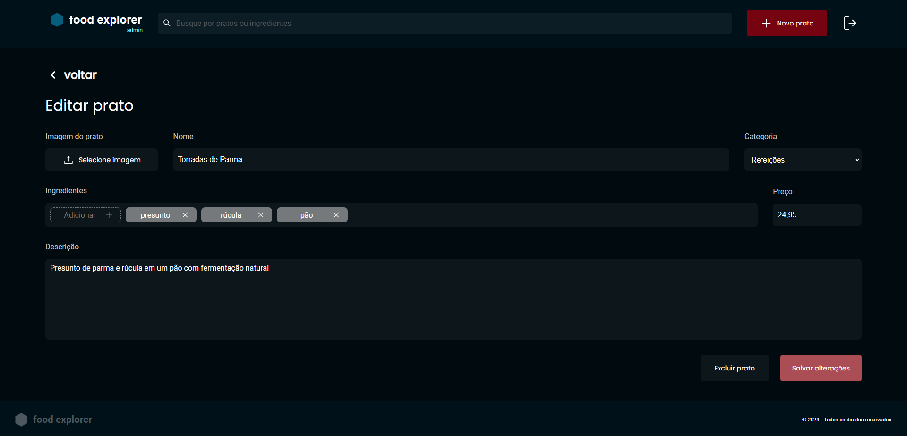
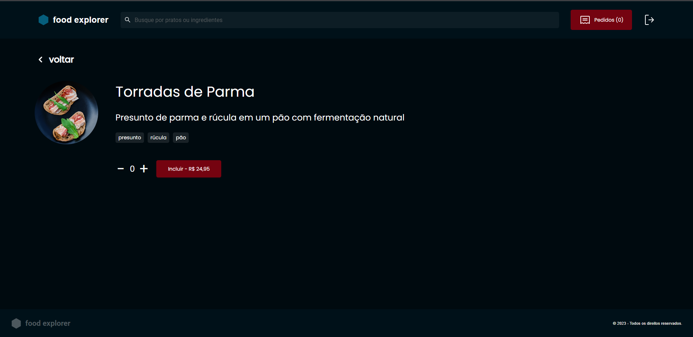

*FOODEXPLORER*

*DESCRIÇÃO*
O foodexplorer é um projeto desenvolvido em react com o intuito de atender pedidos de comida, podendo ser utilizado em um restaurante para atendimento e envio de pedidos, até um aplicativo 100% com pagamentos online de entrega.

*INSTALAÇÃO*
Para começar um projeto igual o foodexplorer, primeiro precisamos iniciar o vite que é um "pré-configurador" de projetos , onde já vem algumas pastas e telas que podemos configurar conforme formos escalando o projeto.
Para saber mais sobre o vite e o seu funcionamento acesse o link abaixo.
*https://vitejs.dev/*

*INICIANDO COM VITE*
para iniciar um projeto com vite abra o prompt de comando e digite o codigo abaixo.

npm create vite@latest

após isto ele ira pedir o nome de seu projeto.

depois de escolher o nome do seu projeto, o configurador irá pedir que selecione o framework ou biblioteca que desejamos utilizar e nisto selecionaremos o react.

*PARA MAIS DETALHES CONSULTE A DOCUMENTAÇÃO*

Após as etapas seu projeto em react pré configurado por vite estará pronto.

*DEPENDENCIAS PRINCIPAIS*
styled-components
axios
react-icon
react-router-dom
splide
react

*PASTAS*

*Assets:*
Pasta de assets pode ser utilizada para armazenar imagens para teste na aplicação ou imagens utilizadas no layout da aplicação

*Components:*
Pasta de componentes contem todos os componentes que criamos para usar nas telas da aplicação.

*Hook:*
Pasta hook contem nosso contexto de autenticação, onde criamos o contexto para armazenarmos funções de sign e sign-up e utilizarmos isto em qualquer parte da aplicação.

*Page:*
Pasta com todas as páginas da nossa aplicação criada.

*Routes:*
Pasta com todas nossas rotas de navegação da aplicação.

*Service:*
Pasta service contem o axios onde configuramos a chamada "url" padrão que usamos para integrar com nosso backend.

*Style*
Pasta de style contem o style global em css , os temas e os breaking points para desenvolvimento mobile da aplicação.

*Utils*
Pasta utils podemos armazenar array feitos para utilizarmos na aplicação e testarmos antes de integrar com o banco, podendo assim acompanhar o funcionamento, porém também pode ser armazenadas para utilidades extras que forem surgindo durante o desenvolvimento.

*FUNCIONAMENTO*
A aplicação conta com dois tipos de rotas, as rotas do administrador e as rotas do usuário.

*Administrador*
Nas rotas "telas" do administrador , o mesmo pode cadastrar, editar, visualizar e deletar um novo produto determinando sua categoria entre, refeições, bebidas e sobremesas.

*Usuário*
Nas rotas "telas" do usuário, o mesmo pode adicionar ao carrinho, visualizar um item e até mesmo favoritar os produtos que mais achou interessante.

*TELAS AUTH*
Tela de login

Tela de criação de conta

*TELAS ADMIN*

Todos os produtos.

Editar ou deletar produto

Criar novo produto

Visualizar produto

*TELAS DE USUÁRIO*
Todos os produtos

Visualizar produto

*BACKEND*
O backend da aplicação foi desenvolvido em nodejs, esta aplicação consome sua própria api, para obter o backend o link do repositório estará abaixo.
*https://github.com/LucasBackend/FoodExplorerBackEnd*
O backend está armazenado no web service do render

*BANCO DE DADOS*
Para esta aplicação o banco de dados utilizado foi o postgresql do render

*DEPLOY*
O deploy feito no projeto foi utilizando o netlify, pela questão de ser um site famoso, confiavel e gratuito, porém cada desenvolvedor pode escolher o que melhor lhe atende.

*CONTRIBUIÇÕES*
Deixo as contribuições em aberto, usem a criatividade nesta aplicação, ainda tem muita oportunidade.
Como criar tela dos itens adicionados no carrinho, pagamento, tela de favoritos etc...

*AGRADECIMENTOS*
Desde já deixo meus agradecimentos a quem gostou e teve interesse neste projeto.
É um projeto bem simples porém com muitas funcionalidades onde podemos aplicar em todos os tipos de projetos.
Caso haja dúvida no projeto ou interesse de networking, abaixo deixo meu linkedin.

*https://www.linkedin.com/in/lucas-ribeiro-95256a140/*